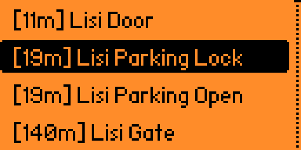

# Nearby Files

A GPS-enabled file browser for Flipper Zero that displays SubGHz, NFC, and RFID files sorted by distance from your current location.




## Features

- **GPS Integration**: Uses real GPS coordinates to calculate distances to files
- **Multi-format Support**: Scans `.sub`, `.nfc`, and `.rfid` files from standard directories
- **Distance-based Sorting**: Files are sorted by proximity to your current GPS location
- **Smart Filtering**: Only displays files containing GPS coordinates
- **Distance Display**: Shows distance to each file (e.g., [45m], [1.3km], [23km])
- **Direct Launch**: Click any file to launch the appropriate app (SubGHz, NFC, or RFID)

## Installation

1. Copy `nearby_files.fap` to the `apps/GPIO` folder on your Flipper Zero SD card
2. Connect a compatible GPS module to your Flipper Zero (see Hardware Setup)

## Usage

### GPS Waiting Screen
The app waits for a valid GPS fix before scanning files. You'll see:
- "No GPS Module" if no GPS hardware is detected.
- "Waiting for GPS..." when looking for GPS satellites.
  - "Satellites: X" showing satellite count while acquiring fix.

### File List
Once GPS coordinates are acquired, the app scans and displays files sorted by distance:
- Files with GPS coordinates are shown with distance indicators
- Files without coordinates are excluded from the list
- Click any file to launch the respective app

### Menu Options
Press Back in the file list to access:
- **Refresh List**: Re-scan files with current GPS position
- **About**: App information and version details

## Hardware Setup

Connect a GPS module to your Flipper Zero using the UART pins. The app uses the NMEA channel configured in Momentum firmware settings.

Recommended connection:
- GPS VCC → Flipper 3.3V (Pin 9)
- GPS GND → Flipper GND (Pin 11) 
- GPS TX → Flipper RX (Pin 14)
- GPS RX → Flipper TX (Pin 13)

## File Requirements

Files must contain GPS coordinates in one of these formats:
```
Lat: 41.123456
Lon: 44.123456
```

> [!Note]
> `Latitude` and `Longitude` keywords are also supported.

## Scanned Directories

The app recursively scans these directories:
- `/ext/subghz/` - SubGHz files (`.sub`)
- `/ext/nfc/` - NFC files (`.nfc`) 
- `/ext/lfrfid/` - RFID files (`.rfid`)

## Requirements

- GPS module connected via GPIO pins.
- SD card with SubGHz/NFC/RFID files containing GPS coordinates.
